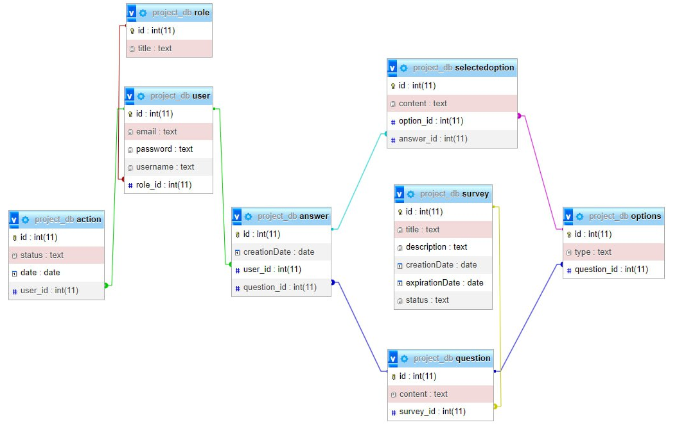

# Проєктування бази даних

## Модель бізнес-об'єктів
@startuml

entity User
entity User.email
entity User.password
entity User.username
entity User.id

entity Role
entity Role.title
entity Role.id

entity Action
entity Action.id
entity Action.status
entity Action.date

entity Question
entity Question.id
entity Question.content

entity Survey
entity Survey.title
entity Survey.id
entity Survey.description
entity Survey.creationDate
entity Survey.expirationDate
entity Survey.status

entity Option
entity Option.id
entity Option.type

entity SelectedOption
entity SelectedOption.id
entity SelectedOption.content

entity Answer
entity Answer.id
entity Answer.creationDate

User *-- User.email
User *-- User.password
User *-- User.username
User *-- User.id

Role *-l- Role.id
Role *-r- Role.title

Action *-- Action.id
Action *-- Action.status
Action *-- Action.date

Question *--- Question.id
Question *--- Question.content

Survey *-l- Survey.title
Survey *--- Survey.id
Survey *--- Survey.description
Survey *--- Survey.creationDate
Survey *--- Survey.expirationDate
Survey *--- Survey.status

Option *--- Option.id
Option *--- Option.type

SelectedOption *-- SelectedOption.id
SelectedOption *-- SelectedOption.content

Answer *-- Answer.id
Answer *-r- Answer.creationDate

User "0,*" -u- "1,1" Role
User "1,1" --- "0,*" Answer
User "1,1" -l- "0,*" Action
Action "0,*" --- "1,1" Survey
Survey "1,1" -r- "0,*" Question
Question "1,1" --- "0,1" Answer
Question "0,*" --- "1,1" Option
Option "1,1" --- "0,*" SelectedOption
SelectedOption "0,*" -r- "1,1" Answer

@enduml

## ER-модель
@startuml 

entity Role  {
    id: INT 
    title: TEXT 
}

entity User { 
    id: INT 
    email: TEXT 
    password: TEXT 
    username: TEXT  
}

entity Action {
    id: INT
    status: TEXT
    date: DATE
}

entity Survey {
    id: INT
    title: TEXT
    description: TEXT
    creationDate: DATE
    expirationDate: DATE
    status: TEXT
}

entity Question { 
    id: INT 
    content: TEXT 
}

entity Option { 
    id:INT 
    type:TEXT 
}

entity SelectedOption {
    id: INT
    content: TEXT
}

entity Answer  {  
    id:INT  
    creationDate: DATE 
}

Role "1, 1" <-- "0, *" User  
User "1, 1" <-- "0, *" Answer
User "1, 1" <-- "0, *" Action
Answer "0, 1" --> "1, 1" Question 
Option "1, 1" <-- "0, *" Question
Survey "1, 1" <-- "0, *" Question
SelectedOption "0, *" --> "1, 1" Option 
SelectedOption "0, *" --> "1, 1" Answer

@enduml
## Реляційна схема

