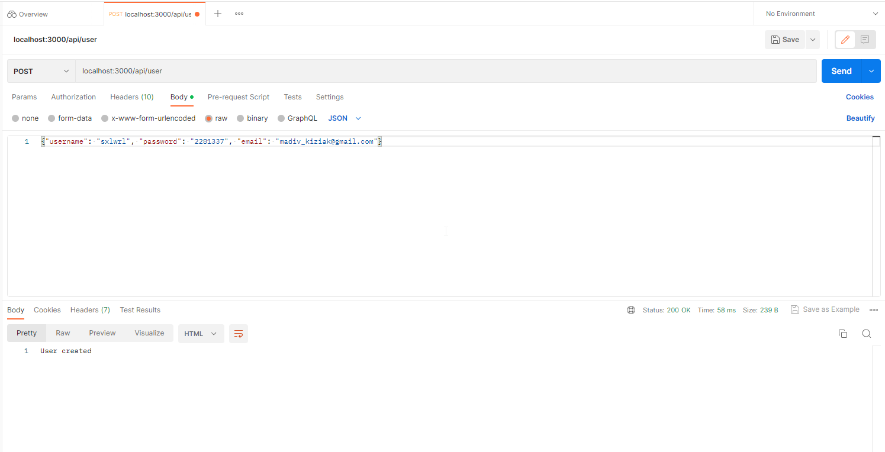
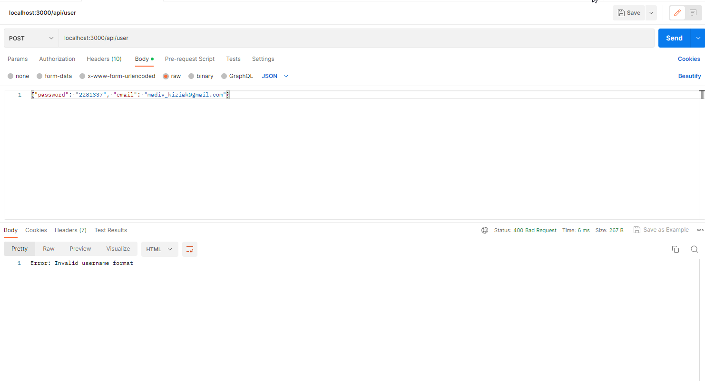
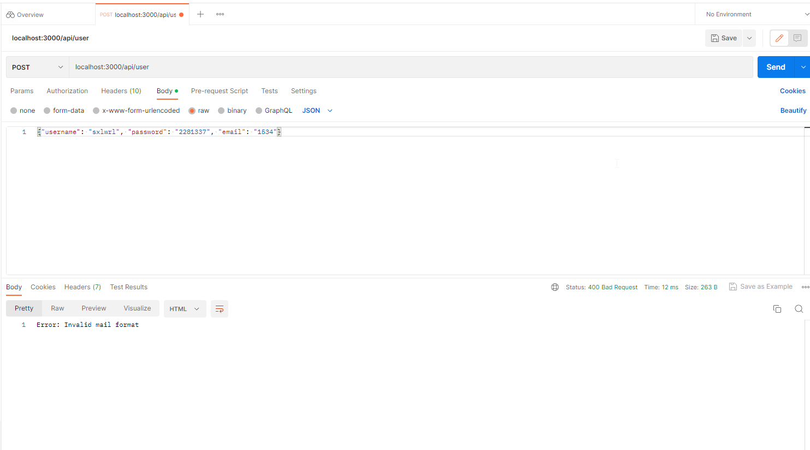
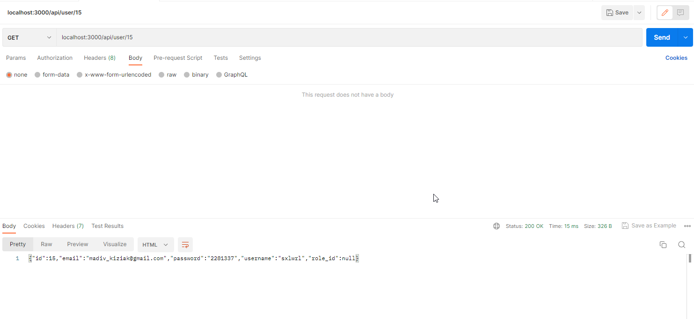
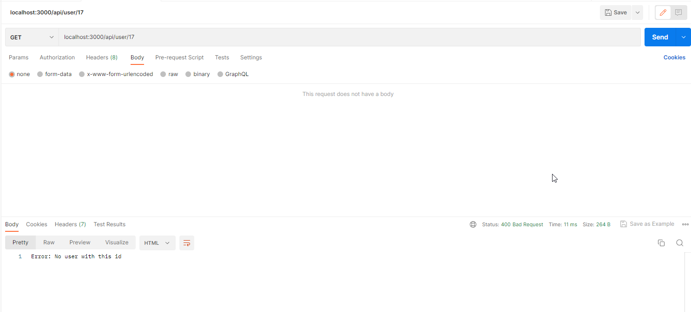
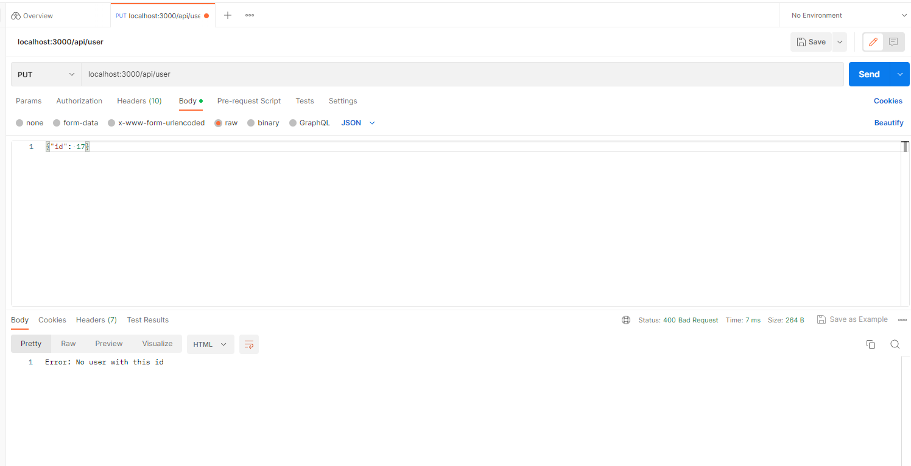
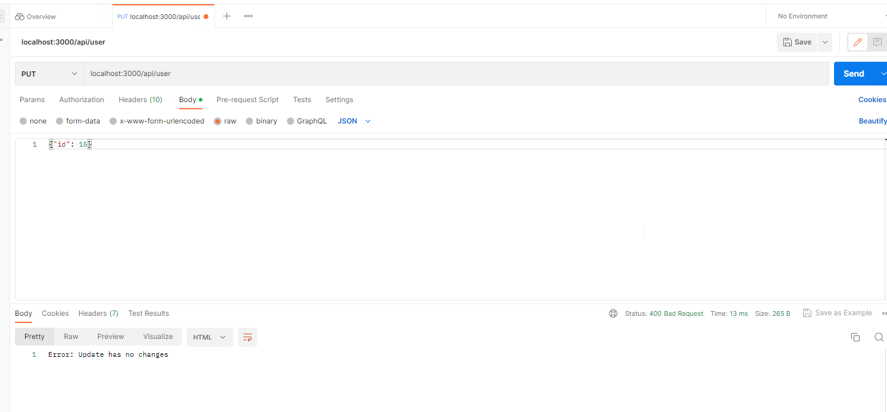
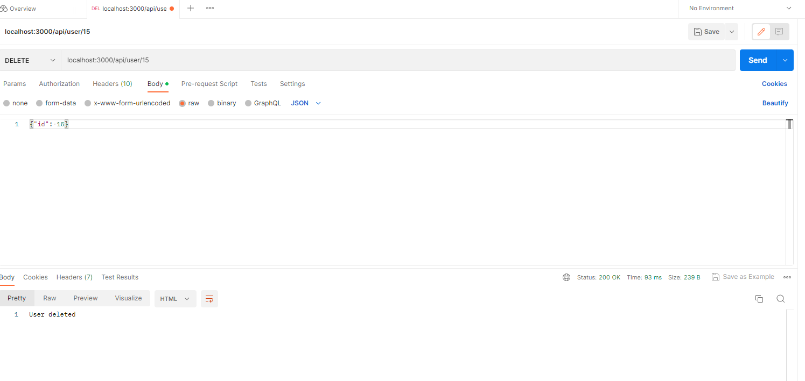
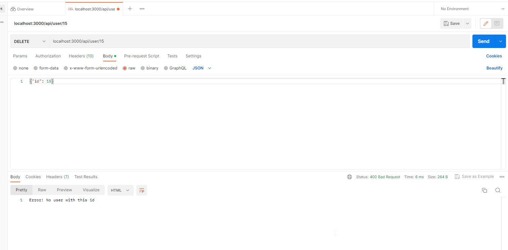

# Тестування працездатності системи

## Створення користувача (успішний запит)

 

## Створення користувача (невірний логін)

 

## Створення користувача (невалідний email)

 

## Пошук користувача за ID (успішний)

 

## Пошук користувача за ID (користувача не існує)

 

## Оновлення користувача

 

## Оновлений користувач

 

## Оновлення користувача (Користувача не існує)

 

## Оновлення користувача (Немає змін)

 

## Видалення користувача

 

## Видалення користувача (Користувача не існує)

 

